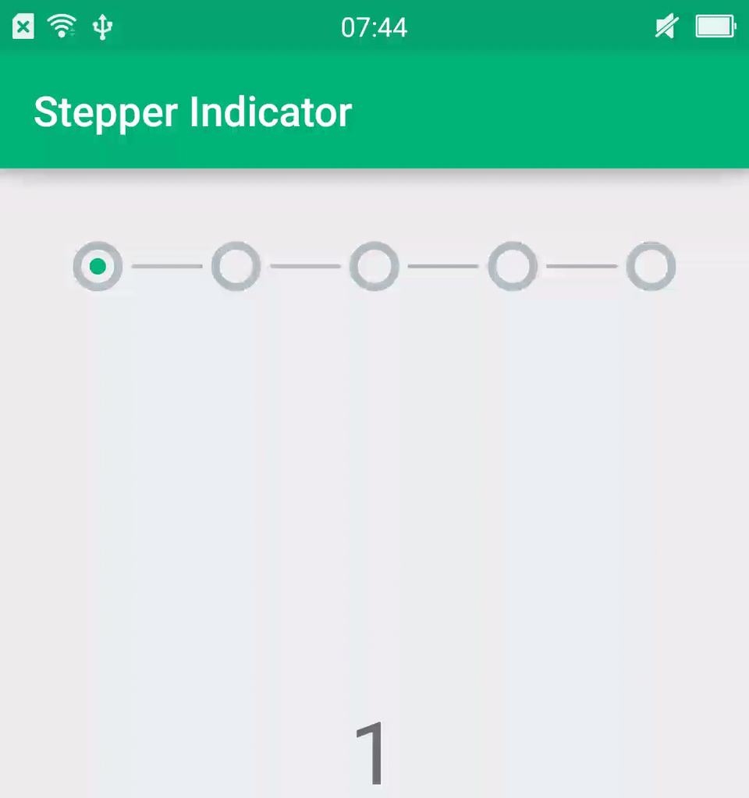

[](https://jitpack.io/#badoualy/stepper-indicator)

#### 依赖
```groovy
// 1.
allprojects {
    repositories {
        maven { url 'https://jitpack.io' }
    }
}
// 2.
dependencies {
    implementation 'com.github.rgdzh1:ViewPager2-Indicator:0.0.4'
}
```
#### Attributes:
| Name                   | Description                                         | Default value   |
|------------------------|-----------------------------------------------------|-----------------|
| stpi_animDuration      | duration of the line tracing animation              | 250 ms          |
| stpi_stepCount         | number of pages/steps                               |                 |
| stpi_circleColor       | color of the stroke circle                          | #b3bdc2 (grey)  |
| stpi_circleRadius      | radius of the circle                                | 10dp            |
| stpi_circleStrokeWidth | width of circle's radius                            | 4dp             |
| stpi_indicatorColor    | color for the current page indicator                | #00b47c (green) |
| stpi_indicatorRadius   | radius for the circle of the current page indicator | 4dp             |
| stpi_lineColor         | color of the line between indicators                | #b3bdc2 (grey)  |
| stpi_lineDoneColor     | color of a line when step is done                   | #00b47c (green) |
| stpi_lineStrokeWidth   | width of the line stroke                            | 2dp             |
| stpi_lineMargin        | margin at each side of the line                     | 5dp             |
| stpi_showDoneIcon      | show the done check icon or not                     | true            |

#### ViewPager指示器使用
```xml
<com.badoualy.stepperindicator.yey.StepperIndicator
    android:layout_width="match_parent"
    android:layout_height="wrap_content"
    app:stpi_stepCount="5"/>
```
```java
indicator.setViewPager(pager);
// or keep last page as "end page"
indicator.setViewPager(pager, pager.getAdapter().getCount() - 1); //
// or manual change
indicator.setStepCount(3);
indicator.setCurrentStep(2);
```
#### ViewPager2指示器使用
`StepperIndicator2`支持在`ViewPager2`中使用.
```xml
<com.badoualy.stepperindicator.yey.StepperIndicator2
    android:id="@+id/stepper_indicator"
    android:layout_width="match_parent"
    android:layout_height="wrap_content"
    app:stpi_stepCount="4" />
```
```java
viewPager2.registerOnPageChangeCallback(new ViewPager2.OnPageChangeCallback() {
    @Override
    public void onPageSelected(int position) {
        super.onPageSelected(position);
        stepperIndicator2.setCurrentStep(position);
    }
});
```
#### 效果


#### Demo下载


Licence
----------------
```
The MIT License (MIT)

Copyright (c) 2016 Yannick Badoual

Permission is hereby granted, free of charge, to any person obtaining a copy
of this software and associated documentation files (the "Software"), to deal
in the Software without restriction, including without limitation the rights
to use, copy, modify, merge, publish, distribute, sublicense, and/or sell
copies of the Software, and to permit persons to whom the Software is
furnished to do so, subject to the following conditions:

The above copyright notice and this permission notice shall be included in all
copies or substantial portions of the Software.

THE SOFTWARE IS PROVIDED "AS IS", WITHOUT WARRANTY OF ANY KIND, EXPRESS OR
IMPLIED, INCLUDING BUT NOT LIMITED TO THE WARRANTIES OF MERCHANTABILITY,
FITNESS FOR A PARTICULAR PURPOSE AND NONINFRINGEMENT. IN NO EVENT SHALL THE
AUTHORS OR COPYRIGHT HOLDERS BE LIABLE FOR ANY CLAIM, DAMAGES OR OTHER
LIABILITY, WHETHER IN AN ACTION OF CONTRACT, TORT OR OTHERWISE, ARISING FROM,
OUT OF OR IN CONNECTION WITH THE SOFTWARE OR THE USE OR OTHER DEALINGS IN THE
SOFTWARE.
```
